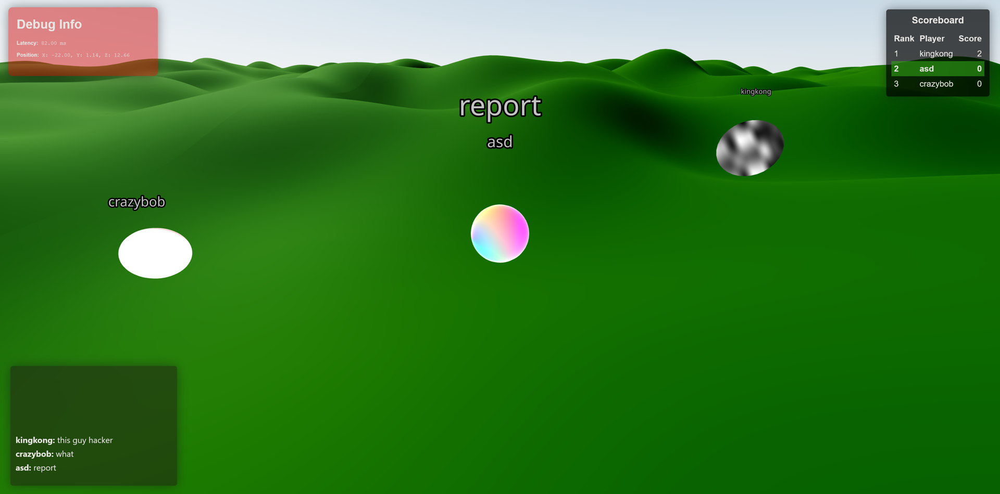

# Multiplayer .io Game in React Three Fiber

This project is a multiplayer `.io` game built with **React Three Fiber**. Players control a character that grows bigger by collecting food and can eat smaller players. The game features **real-time multiplayer** using WebSockets, **procedural terrain**, **Rapier physics integration**, and **dynamic prop generation**. A simple chat system is included for communication between players. The game is optimized for **low load times** and runs entirely within a React app.



## Features

- **Multiplayer Support**: Real-time interaction between players using WebSocket connections for fast, low-latency communication.
- **Procedural Terrain**: Infinite, randomly generated terrain for players to explore.
- **Rapier Physics Integration**: Realistic physics simulation for player movement and interaction.
- **Dynamic Prop Generation**: Random food and prop spawning on the terrain.
- **Growth Mechanism**: Players grow larger as they consume food, and can eat smaller players when larger.
- **Chat System**: Simple in-game text chat for communication between players.
- **Optimized Performance**: Minimal load times with smooth rendering.

## Technologies Used

- **React Three Fiber**: For 3D rendering within React.
- **WebSockets**: For real-time communication between clients and server.
- **Rapier Physics Engine**: For handling physics simulation in the game.
- **Procedural Generation**: Dynamically generated terrain and props for endless play.
- **React**: Frontend framework for creating the user interface.

## Setup Instructions

1. Clone the repository:

   ```bash
   git clone https://github.com/your-repo/multiplayer-io-game.git
   cd multiplayer-io-game

2. Install dependencies:

   ```
   npm install

3. Start development server and client:

   ```
   npm start

## How to Play

- Use `WASD` or arrow keys to move your character around the terrain.
- Collect food scattered on the terrain to grow larger.
- Once you are bigger than another player, you can eat them.
- Chat with other players using the in-game chat box.

## Game Flow

1. Players join a server via WebSocket and spawn on the procedural terrain.
2. As players move around, they can collect food to grow in size.
3. Larger players can eat smaller players, causing the smaller player to respawn.
4. The game runs continuously, allowing players to compete to become the largest.

## Contributing

Contributions are welcome! Please open an issue or submit a pull request if you have any improvements or bug fixes.

## License

This project is licensed under the MIT License. See the [LICENSE](LICENSE) file for more details.

---

Enjoy the game and good luck becoming the biggest player!